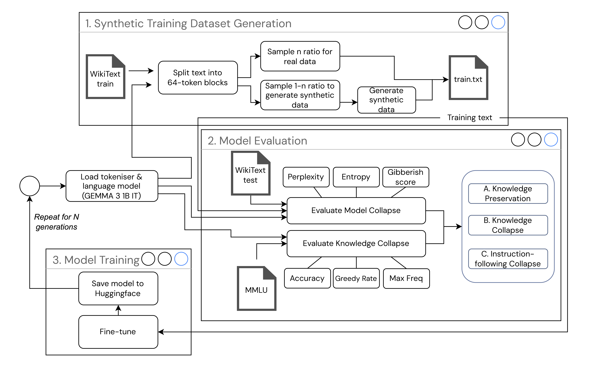

# Knowledge Collapse Framework

A comprehensive framework for evaluating and studying knowledge collapse in language models through iterative training with synthetic data.

## Introduction

Knowledge collapse is a phenomenon where language models progressively lose their ability to generate diverse and coherent content when trained iteratively on synthetic data generated by previous model iterations. This framework provides tools to systematically study this phenomenon through controlled experiments.


The framework enables researchers to:
- Train models iteratively with varying ratios of synthetic vs. real data
- Evaluate model degradation across multiple metrics
- Track knowledge collapse stages through comprehensive analysis
- Support multiple model architectures and evaluation methodologies



## Features

### Core Functionality
- **Iterative Training Pipeline**: Automated training loops with configurable synthetic data ratios
- **Multi-Model Support**: Compatible with GPT-2, Gemma, Phi, SmolLM, and other transformer models
- **Comprehensive Evaluation**: Multiple evaluation metrics including entropy, perplexity, and domain-specific assessments
- **MMLU Integration**: Automated evaluation on Massive Multitask Language Understanding benchmarks
- **Experiment Tracking**: Detailed logging and result storage with HuggingFace Hub integration

### Evaluation Metrics
- **Shannon Entropy**: Measures lexical diversity and repetition patterns
- **Gibberish Detection**: Automated assessment of text quality degradation
- **Perplexity Analysis**: Evaluates model confidence and coherence
- **MMLU Performance**: Domain-specific knowledge retention across subjects
- **Greedy Decoding Analysis**: Tracks deterministic behavior patterns

## Installation

1. Clone the repository:
```bash
git clone https://github.com/your-username/knowledge-collapse.git
cd knowledge-collapse
```

2. Install dependencies:
```bash
pip install -r requirements.txt
```

3. Set up HuggingFace Repository:
   - Create an account at [HuggingFace](https://huggingface.co/)
   - Create a new model repository for storing experiment outputs
   - Generate an access token from your HuggingFace settings
   - Note your repository ID in format `username/repository-name`

4. Set up Telegram Notifications (Optional but Recommended):
   - Create a Telegram bot by messaging [@BotFather](https://t.me/botfather)
   - Send `/newbot` and follow instructions to get your bot token
   - Get your Telegram Chat ID:
     - Send a message to your bot
     - Visit `https://api.telegram.org/bot<YourBOTToken>/getUpdates`
     - Find your chat ID in the response
     - Alternatively, follow [this guide](https://www.wikihow.com/Know-Chat-ID-on-Telegram-on-Android#:~:text=Are%20you%20trying%20to%20find,is%20your%20Telegram%20chat%20ID.) for Android users

5. Create environment variables file:
```bash
# Create a .env file with the following variables:
HUGGINGFACE_TOKEN=your_hf_access_token
HUGGINGFACE_REPO_ID=username/repository-name
TELEGRAM_BOT_TOKEN=your_telegram_bot_token  # Optional for progress notifications
TELEGRAM_CHAT_ID=your_telegram_chat_id      # Optional for progress notifications
```

### Environment Variables Explained

- **HUGGINGFACE_TOKEN**: Required for uploading models and results to HuggingFace Hub
- **HUGGINGFACE_REPO_ID**: Your HuggingFace repository where models and logs will be stored
- **TELEGRAM_BOT_TOKEN**: Optional bot token for receiving experiment progress notifications
- **TELEGRAM_CHAT_ID**: Optional chat ID for receiving Telegram notifications about experiment status, completion, and results

### Why Set Up Telegram Notifications?

Telegram notifications provide real-time updates about your experiments, including:
- 🚀 Generation start notifications with current parameters
- ✅ Generation completion with key metrics (entropy, gibberish score, perplexity)
- 📝 MMLU evaluation results by subject group
- ❌ Error notifications if experiments fail
- 🎉 Final completion notification when all experiments finish

This is especially useful for long-running experiments that may take hours or days to complete.

## Usage

### Basic Usage

Run a complete knowledge collapse experiment:

```bash
python runner_collapse.py
```

### Advanced Usage

#### Specify Model and Parameters
```bash
# Use a specific model
python runner_collapse.py --model_name gpt2

# Start from a specific generation
python runner_collapse.py --start_generation 5

# Reset and start from scratch
python runner_collapse.py --reset_generation

# Use domain-specific data (MMLU topic)
python runner_collapse.py --mmlu_topic world_religions
```

#### Available Models
- `gemma31b`: Gemma 3 1B Instruct (default)
- `gemma22b`: Gemma 2 2B Instruct  
- `gpt2`: GPT-2 Base
- `gpt2-medium`, `gpt2-large`, `gpt2-xl`: GPT-2 variants
- `phi15`: Microsoft Phi-1.5
- `smollm17`: SmolLM 1.7B

### Configuration

Modify experiment parameters in `utils/model_configuration.py`:

```python
SYNTHETIC_RATIOS = [0.5]  # Ratio of synthetic data (0.0 to 1.0)
SAMPLES_PER_GENERATION = 8000  # Training samples per generation
GENERATIONS = 16  # Number of training iterations
```

## Framework Architecture

### Core Components

#### 1. Training Pipeline (`utils/finetuning.py`)
- **Data Preparation**: Processes WikiText-2 or domain-specific datasets
- **Synthetic Generation**: Blockwise generation with configurable parameters
- **Fine-tuning**: Automated model training with optimal hyperparameters

#### 2. Evaluation Suite (`utils/evaluation.py`)
- **Text Analysis**: Shannon entropy, gibberish detection, perplexity computation
- **MMLU Evaluation**: Multi-subject knowledge assessment with various prompting strategies
- **Performance Tracking**: Detailed logging of all evaluation metrics

#### 3. Model Management (`utils/utilities.py`)
- **Hub Integration**: Automatic upload/download from HuggingFace Hub
- **Version Control**: Generation-based model versioning and recovery
- **Resource Management**: Efficient caching and cleanup utilities

#### 4. Configuration System (`utils/model_configuration.py`)
- **Model Mappings**: Centralized configuration for supported models
- **Experiment Settings**: Configurable parameters for different research scenarios
- **Device Management**: Automatic GPU/CPU detection and utilization

### Workflow

1. **Initialization**: Load base model and tokenizer
2. **Data Preparation**: Sample real data from training corpus
3. **Iterative Process** (repeated for each generation):
   - Generate synthetic data using current model
   - Combine synthetic and real data based on specified ratio
   - Evaluate combined dataset across all metrics
   - Fine-tune model on combined dataset
   - Save model and upload to Hub
4. **Results Analysis**: Aggregate and analyze collapse patterns

## Output and Results

### Generated Files

- `entropy_results.json`: Shannon entropy measurements across generations
- `mmlu_results.json`: MMLU performance across all subjects and prompting strategies
- `log_entropy_results.json`: Timestamped experiment logs
- `mmlu/`: Detailed per-question evaluation logs

### Key Metrics Tracked

- **Entropy Mean/Std**: Lexical diversity measurements
- **Gibberish Score**: Text quality assessment (0=noise, 3=clean)
- **Perplexity**: Model confidence on validation data
- **MMLU Accuracy**: Knowledge retention across domains
- **Greedy Proportion**: Deterministic behavior patterns

### Analysis Examples

Monitor knowledge collapse progression:
```python
import json

# Load results
with open('entropy_results.json', 'r') as f:
    entropy_data = json.load(f)

# Analyze entropy decline
for generation in entropy_data['50%']:
    print(f"Gen {generation['generation']}: Entropy = {generation['entropy_mean']:.3f}")
```

## Research Applications

### Supported Research Questions

1. **Collapse Threshold Analysis**: At what synthetic data ratio does significant degradation occur?
2. **Model Size Effects**: How does model capacity affect collapse resistance?
3. **Domain Specificity**: Does collapse vary across different knowledge domains?
4. **Recovery Mechanisms**: Can models recover from collapse stages?
5. **Early Warning Signs**: What metrics best predict impending collapse?

### Customization Options

- **Custom Datasets**: Replace WikiText-2 with domain-specific corpora
- **Alternative Metrics**: Add custom evaluation functions
- **Model Architectures**: Extend support to new model families
- **Prompting Strategies**: Implement novel evaluation methodologies

## Contributing

1. Fork the repository
2. Create a feature branch: `git checkout -b feature-name`
3. Commit changes: `git commit -am 'Add new feature'`
4. Push to branch: `git push origin feature-name`
5. Submit a pull request

## License

This project is licensed under the MIT License - see the LICENSE file for details.

## Acknowledgments

- Built on HuggingFace Transformers library
- MMLU evaluation based on the original benchmark
- Inspired by research on model collapse phenomena